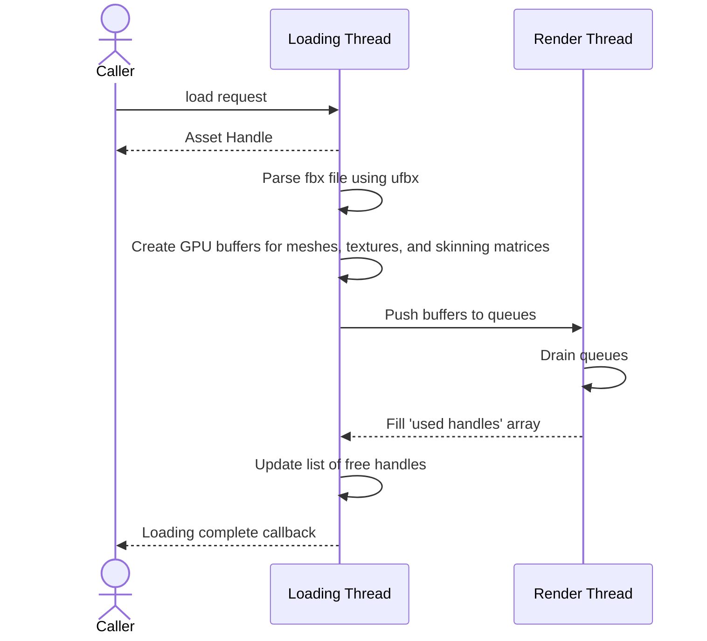
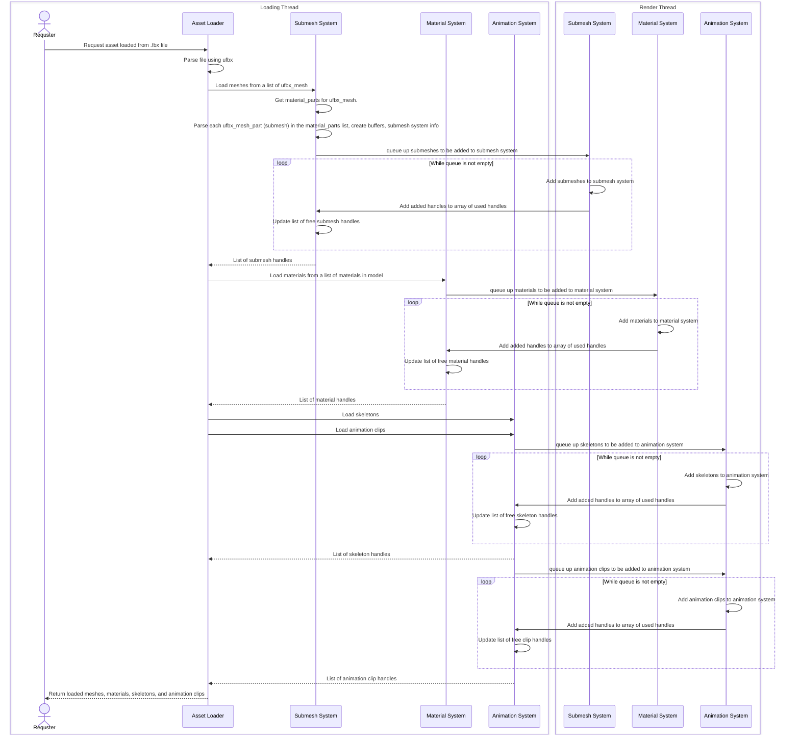

# Asset Loading
## Loading Models
When requesting that a model be loaded in, the caller passes in the filepath to a `.fbx` file, as well as a callback function that is to be called once loading has finished.

During loading, items are queued up to be inserted into different systems, with handles being assigned based on listed free handles and the number of entries in each system.





```cpp
using LoadedModelHandle = uint16_t;
using LoadedMeshHandle = uint16_t;

struct LoadedMeshInfo
{
    SubmeshHandle* submeshes;
    MaterialHandle* materials;
    MaterialType* materialTypes;
    size_t submeshCount;
    size_t materialCount;
};

struct LoadedSkeletonsInfo
{
    SkeletonHandle* skeletons;
    size_t skeletonCount;
};

struct LoadedAnimationClipsInfo
{
    AnimationClip* animationClips;
    size_t clipCount;
};

struct LoadedModelInfo
{
    LoadedMeshInfo* meshes;
    LoadedSkeletonsInfo skeletons;
    LoadedAnimationClipsInfo animationClips;
    size_t meshCount;
};
```
When removing a skeleton, the animation clips that use them must be removed first.
```cpp
class ModelLoadingSystem
{
    public:
    ModelLoadingSystem(TextureLoader& textureLoader);
    
    LoadedModelHandle load(std::filesystem::path filepath, void* callback);
    LoadedModelHandle add(LoadedModelInfo modelInfo);
    void removeLoadedModel(LoadedModelHandle model, void* callback);
    void removeAnimationClip(AnimationClipHandle animationClip, void* callback);
    void removeSkeleton(SkeletonHandle skeleton, void* callback);
    void removeMaterial(MaterialHandle material, void* callback);
    void removeLoadedMesh(LoadedMeshHandle mesh, void* callback);
}
```

### Loading Materials From .fbx Files
When a material is stored in an fbx file, the textures associated with the material are loaded in using the `TextureLoader` class. Before they are loaded in, a "dummy material" is used in their place. 

Once the number of loaded items using a texture reaches 0, the texture will be unloaded.
```cpp
struct TrackedTexture
{
    MTL::Texture* texture;
    uint32_t useCount;
};

class TextureLoader
{
    public:
    MTL::Texture* loadTexture(std::filesystem::path filepath);
    void unloadTexture(MTL::Texture* texture);
    void forceUnloadTexture(MTL::Texture* texture);

    private:
    std::unordered_map<std::filesystem::path, TrackedTexture> fileToTextureMap;
};
```